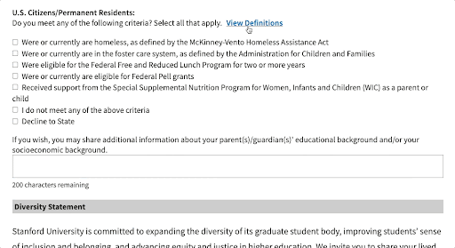

# Show/Hide (showHide)
Shows or Hides a section of text when clicking on a link.



## How to Configure
1. Create a link to show/hide the text. This can be anywhere on the page.
```html
<a data-sse-showhide="showhide-text" href="#">Click Here</a>
```

The value of `data-sse-showhide` should be the id of the div surrounding the text created below.

2. Add the text. This can be anywhere on the page as well.
```html
<div id="showhide-text">
  <p>
    This is the text to show/hide
  </p>
</div>
```